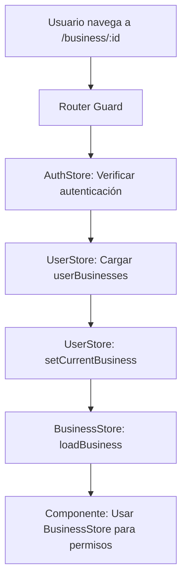

# 🏗️ Arquitectura Coherente - Sistema Multi-Negocio

## 📋 Resumen

Se ha implementado una arquitectura coherente que separa claramente las responsabilidades entre stores, con **BusinessStore como la fuente de verdad para datos específicos del negocio**.

## 🎯 Principios de la Arquitectura

### 1. **UserStore** - Gestión de Usuario y Relaciones

**Responsabilidad**: Gestionar al usuario y sus relaciones con negocios

```javascript
state: {
  userProfile: {},           // Datos básicos del usuario
  userBusinesses: [],        // Lista de negocios a los que tiene acceso
  currentBusiness: {}        // Negocio activo (solo ID, nombre, rol básico)
}
```

**Métodos principales**:

- `loadUserProfile(uid)` - Cargar perfil del usuario
- `loadUserBusinesses(uid)` - Cargar negocios del usuario
- `setCurrentBusiness(businessId)` - Cambiar negocio activo
- `switchBusiness(businessId)` - Alias del anterior

### 2. **BusinessStore** - Datos Completos del Negocio

**Responsabilidad**: Gestionar datos completos de UN negocio específico

```javascript
state: {
  business: {},              // Datos completos del negocio actual
  employees: [],             // Empleados del negocio
  currentUserRole: '',       // Rol del usuario en este negocio
  currentUserPermissions: {} // Permisos del usuario en este negocio
}
```

**Métodos principales**:

- `loadBusiness(businessId, userBusiness)` - Cargar negocio completo
- `clearCurrentBusiness()` - Limpiar datos del negocio
- `hasPermission(permission)` - Verificar permisos específicos

### 3. **AuthStore** - Autenticación Pura

**Responsabilidad**: Solo autenticación de Firebase

```javascript
state: {
  user: {},                  // Usuario autenticado
  isAuthenticated: boolean   // Estado de autenticación
}
```

## 🔄 Flujo de la Arquitectura



## 🛠️ Implementación en Componentes

### Router Guard

```javascript
// ✅ ARQUITECTURA COHERENTE
if (userStore.currentBusiness?.businessId !== businessId) {
  await userStore.setCurrentBusiness(businessId); // UserStore: relación
}

if (businessStore.business?.id !== businessId) {
  await businessStore.loadBusiness(businessId, userBusiness); // BusinessStore: datos
}

// Verificar permisos con BusinessStore
if (to.meta.permission && !businessStore.hasPermission(to.meta.permission)) {
  return next("/dashboard");
}
```

### Componentes Vue

```javascript
// MainLayout.vue y DashboardRedirect.vue
import { useUserStore } from "@/stores/useUserStore";
import { useBusinessStore } from "@/stores/businessStore";

const userStore = useUserStore();
const businessStore = useBusinessStore();

// ✅ Usar cada store para su propósito específico
const currentBusiness = computed(() => userStore.currentBusiness); // Relación básica
const businessData = computed(() => businessStore.business); // Datos completos
const isManager = computed(() => businessStore.isCurrentUserManager);
const hasPermission = (perm) => businessStore.hasPermission(perm);
```

## 🎨 Beneficios de esta Arquitectura

### ✅ **Separación Clara de Responsabilidades**

- **UserStore**: Solo relaciones usuario-negocio
- **BusinessStore**: Solo datos específicos del negocio
- **AuthStore**: Solo autenticación

### ✅ **Escalabilidad**

- Fácil agregar nuevos tipos de datos al BusinessStore
- UserStore no se sobrecarga con datos de negocio
- Cada store tiene un propósito específico

### ✅ **Mantenibilidad**

- Código más limpio y predecible
- Errores más fáciles de debuggear
- Lógica centralizada en el store correcto

### ✅ **Performance**

- BusinessStore solo carga cuando se necesita
- UserStore mantiene datos ligeros
- No duplicación de datos entre stores

## 🔧 Métodos Principales por Store

### UserStore

```javascript
// Gestión de relaciones usuario-negocio
await userStore.loadUserBusinesses(uid);
await userStore.setCurrentBusiness(businessId);
userStore.clearUserData();

// Getters para relaciones
userStore.isManager; // ¿Es gerente de algún negocio?
userStore.hasBusinesses; // ¿Tiene negocios?
userStore.primaryBusiness; // Negocio principal
```

### BusinessStore

```javascript
// Gestión de datos del negocio
await businessStore.loadBusiness(businessId, userBusiness);
businessStore.clearCurrentBusiness();

// Getters para el negocio actual
businessStore.isCurrentUserManager; // ¿Es gerente de este negocio?
businessStore.getCurrentUserRole; // Rol en este negocio
businessStore.hasPermission(permission); // ¿Tiene este permiso?
```

## 📱 Casos de Uso Comunes

### 1. **Cambiar de Negocio**

```javascript
// 1. Cambiar en UserStore (relación)
await userStore.setCurrentBusiness(newBusinessId);

// 2. Cargar datos en BusinessStore (datos completos)
await businessStore.loadBusiness(newBusinessId, userBusiness);

// 3. Los componentes se actualizan automáticamente
```

### 2. **Verificar Permisos**

```javascript
// ✅ Usar BusinessStore (fuente de verdad)
if (businessStore.hasPermission("crearMovimientos")) {
  // Mostrar botón de crear
}

// ❌ NO usar UserStore para permisos específicos
```

### 3. **Mostrar Información del Usuario**

```javascript
// ✅ Datos básicos del usuario
const userName = computed(() => userStore.userProfile?.nombre);

// ✅ Relación con el negocio actual
const businessRelation = computed(() => userStore.currentBusiness);

// ✅ Datos completos del negocio
const businessDetails = computed(() => businessStore.business);
```

## 🐛 Errores Comunes Evitados

### ❌ **Antes (Problemático)**

```javascript
// Mixing responsabilidades
const hasPermission = userStore.currentBusiness?.permissions?.[permission];
const businessData = userStore.businessData; // No existe
```

### ✅ **Ahora (Correcto)**

```javascript
// Responsabilidades claras
const hasPermission = businessStore.hasPermission(permission);
const businessData = businessStore.business;
const userBusinessRelation = userStore.currentBusiness;
```

## 🎯 Próximos Pasos

1. **Implementar carga lazy de datos del negocio**
2. **Agregar cache inteligente en BusinessStore**
3. **Implementar sincronización real-time**
4. **Agregar más validaciones de permisos**

---

**✅ Esta arquitectura garantiza coherencia técnica, escalabilidad y mantenibilidad a largo plazo.**
