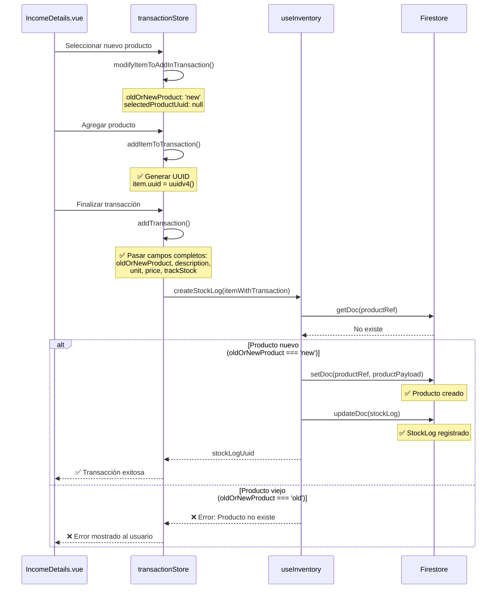

# Fix: Error al crear StockLog para productos nuevos

**Fecha:** 3 de diciembre de 2025
**Tipo:** Bug Fix - Sistema de transacciones e inventario
**Prioridad:** Alta
**Estado:** ✅ Resuelto

---

## 🐛 Problema identificado

Cuando se seleccionaba un **nuevo producto** en `IncomeDetails.vue`, el sistema lanzaba el siguiente error:

```
Error: El producto no existe en Firestore
ID: 3a8f6ced-b75c-418e-8239-218ecade952e
Business: FARMACIA-59c669f3

Posibles causas:
1. El producto fue marcado como "old" pero nunca fue creado
2. El producto fue eliminado previamente
3. Error en la sincronización de datos
```

### Causa raíz

El flujo de creación de transacciones de ingreso tenía los siguientes problemas:

1. **No se generaba UUID para productos nuevos**: Cuando se agregaba un nuevo producto al array `items`, no se le asignaba un UUID único.

2. **No se pasaban campos necesarios al createStockLog**: La función `createStockLog` recibía el item pero sin los campos críticos como `oldOrNewProduct`, `description`, `unit`, `price`, y `trackStock`.

3. **createStockLog no creaba productos automáticamente**: Aunque detectaba que el producto no existía, no tenía lógica para crear productos nuevos automáticamente.

---

## ✅ Solución implementada

### 1. Generación automática de UUID en `addItemToTransaction()`

**Archivo:** `src/stores/transaction/transactionStore.js`

```javascript
const addItemToTransaction = () => {
  const item = { ...itemToAddInTransaction.value };

  // ✅ GENERAR UUID PARA PRODUCTOS NUEVOS
  if (item.oldOrNewProduct === "new" && !item.selectedProductUuid) {
    item.uuid = uuidv4();
    item.selectedProductUuid = item.uuid; // Mantener consistencia
    console.log("🆕 UUID generado para producto nuevo:", {
      description: item.description,
      uuid: item.uuid,
    });
  } else if (item.oldOrNewProduct === "old" && item.selectedProductUuid) {
    // Para productos existentes, usar el UUID del producto seleccionado
    item.uuid = item.selectedProductUuid;
  }

  // ... resto del código
};
```

**Beneficios:**

- Cada producto nuevo tiene un identificador único desde el momento en que se agrega
- Los productos existentes mantienen su UUID original
- Consistencia en la estructura de datos

---

### 2. Paso de campos completos en `addTransaction()`

**Archivo:** `src/stores/transaction/transactionStore.js`

```javascript
const itemWithTransaction = {
  ...item,
  transactionId: transactionToAdd.value.uuid,
  quantity: item.quantity,
  quantityForStock: item.quantityForStock,
  // ✅ CAMPOS NECESARIOS PARA CREAR PRODUCTO NUEVO AUTOMÁTICAMENTE
  oldOrNewProduct: item.oldOrNewProduct,
  description: item.description,
  unit: item.unit,
  price: item.price,
  trackStock: item.trackStock !== undefined ? item.trackStock : false,
  productType: "MERCH", // Tipo por defecto para productos de venta
};

console.log("📦 Procesando item para stockLog:", {
  uuid: itemWithTransaction.uuid,
  description: itemWithTransaction.description,
  oldOrNewProduct: itemWithTransaction.oldOrNewProduct,
  quantity: itemWithTransaction.quantity,
  price: itemWithTransaction.price,
  trackStock: itemWithTransaction.trackStock,
});

const stockLogUuid = await createStockLog(itemWithTransaction);
```

**Beneficios:**

- `createStockLog` recibe toda la información necesaria
- Logging completo para debugging
- Transparencia en el flujo de datos

---

### 3. Creación automática de productos en `createStockLog()`

**Archivo:** `src/composables/useInventory.js`

```javascript
const productRef = doc(db, `businesses/${businessId}/products`, item.uuid);

// Verificar si el producto existe antes de actualizar
const productDoc = await getDoc(productRef);

if (!productDoc.exists()) {
  // ✅ CREACIÓN AUTOMÁTICA DE PRODUCTO NUEVO
  if (item.oldOrNewProduct === "new") {
    console.log("🆕 Producto nuevo detectado, creando automáticamente:", {
      productId: item.uuid,
      description: item.description,
      type: typeStockLog,
    });

    // Crear el producto antes de registrar el stockLog
    const productPayload = {
      description: (item.description || "").trim().toUpperCase(),
      price:
        item.price !== undefined && item.price !== null
          ? Number(item.price)
          : 0,
      cost:
        item.cost !== undefined && item.cost !== null ? Number(item.cost) : 0,
      stock: 0, // Stock inicial es 0, se ajustará con el stockLog
      unit: item.unit || "uni",
      type: item.productType || "MERCH",
      trackStock: item.trackStock !== undefined ? item.trackStock : true,
      stockLog: [],
      createdAt: serverTimestamp(),
    };

    await setDoc(productRef, productPayload);

    console.log("✅ Producto creado exitosamente antes del stockLog:", {
      id: item.uuid,
      description: productPayload.description,
      trackStock: productPayload.trackStock,
    });
  } else {
    // ❌ ERROR: Producto marcado como "old" pero no existe
    throw new Error(
      `El producto "${
        item.description || item.uuid
      }" no existe en Firestore.\n` +
        `ID: ${item.uuid}\n` +
        `Business: ${businessId}\n` +
        `Marcado como: ${item.oldOrNewProduct || "desconocido"}\n\n` +
        `Posibles causas:\n` +
        `1. El producto fue marcado como "old" pero nunca fue creado\n` +
        `2. El producto fue eliminado previamente\n` +
        `3. Error en la sincronización de datos\n\n` +
        `Solución: Verifica que el producto exista antes de crear stock logs, ` +
        `o márcalo como "new" si es la primera vez que se usa.`
    );
  }
}
```

**Beneficios:**

- **Creación automática**: Los productos nuevos se crean en Firestore antes de registrar el stockLog
- **Validación estricta**: Los productos marcados como "old" deben existir
- **Mensajes de error mejorados**: Incluyen el tipo de producto para debugging
- **Stock inicial correcto**: Se crea con stock 0, que se ajustará con el stockLog

---

## 🔄 Flujo completo actualizado



---

## 🧪 Casos de prueba

### ✅ Caso 1: Agregar nuevo producto

1. Ir a IncomeDetails.vue
2. Buscar un producto que no existe
3. Escribir "CAMISA" → Seleccionar "Registrar nuevo producto: CAMISA"
4. Ingresar cantidad y precio
5. Agregar al carrito
6. Finalizar transacción

**Resultado esperado:**

- ✅ UUID generado automáticamente
- ✅ Producto creado en Firestore
- ✅ StockLog registrado correctamente
- ✅ Transacción completada sin errores

### ✅ Caso 2: Agregar producto existente

1. Ir a IncomeDetails.vue
2. Buscar un producto existente en el inventario
3. Seleccionarlo de la lista
4. Ingresar cantidad
5. Agregar al carrito
6. Finalizar transacción

**Resultado esperado:**

- ✅ UUID del producto existente se mantiene
- ✅ StockLog registrado correctamente
- ✅ Stock actualizado
- ✅ Transacción completada sin errores

### ✅ Caso 3: Producto marcado como "old" pero no existe (error intencional)

**Escenario:** El producto fue eliminado pero quedó en caché

**Resultado esperado:**

- ❌ Error claro indicando que el producto no existe
- ❌ Mensaje con ID del producto y businessId
- ❌ Sugerencias de solución

---

## 🔍 Validaciones implementadas

### En `addItemToTransaction()`:

- ✅ Generar UUID solo para productos nuevos
- ✅ Mantener UUID para productos existentes
- ✅ Logging de operación

### En `addTransaction()`:

- ✅ Pasar todos los campos necesarios a `createStockLog`
- ✅ Logging detallado del item procesado
- ✅ Mantener trazabilidad completa

### En `createStockLog()`:

- ✅ Verificar existencia del producto
- ✅ Crear automáticamente productos nuevos
- ✅ Validar productos marcados como "old"
- ✅ Mensajes de error descriptivos

---

## 📋 Reset automático al cerrar

El sistema ya tiene implementado el reset automático cuando se cierra el modal:

**Componente:** `CloseBtn.vue`
**Composable:** `useCloseBtn.js`

```javascript
const closeBtnConfig = {
  flowStore: flow,
  additionalStores: {
    transactionStore,
  },
  flowType: FLOW_TYPES.TRANSACTION,
};
```

Cuando el usuario cierra el modal:

1. ✅ Se ejecuta `transactionStore.resetTransactionToAdd()`
2. ✅ Se limpia `itemToAddInTransaction`
3. ✅ Se resetea `transactionsInStore`
4. ✅ Se navega a la vista anterior

---

## 🚀 Mejoras futuras (opcional)

1. **Validación de productos duplicados**: Verificar si ya existe un producto con el mismo nombre antes de crear uno nuevo

2. **Modo offline-first**: Crear productos en IndexedDB y sincronizar cuando haya conexión

3. **Autocorrección de nombres**: Sugerir productos similares antes de crear uno nuevo

4. **Bulk product creation**: Permitir crear múltiples productos en una sola operación

5. **Product categories**: Agregar categorización automática basada en descripción

---

## 📊 Impacto de la solución

### Antes:

- ❌ Error al intentar vender productos nuevos
- ❌ Flujo de trabajo interrumpido
- ❌ Confusión del usuario

### Después:

- ✅ Productos nuevos se crean automáticamente
- ✅ Flujo de trabajo fluido y natural
- ✅ Experiencia de usuario mejorada
- ✅ Validaciones robustas
- ✅ Mensajes de error claros

---

## 🏷️ Tags

`#bug-fix` `#inventory` `#transactions` `#stock-management` `#product-creation` `#firestore` `#validation`
