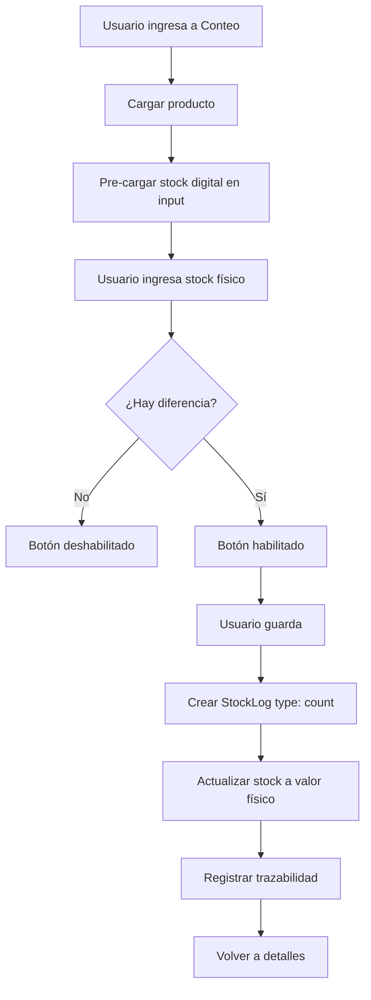

# Sistema de Conteo de Inventario - Documentación

## 📋 Resumen General

Se ha implementado un sistema completo de conteo de inventario que permite verificar el stock físico contra el stock digital y ajustar automáticamente las discrepancias detectadas.

## 🎯 Características Principales

### 1. **Flujo de Conteo**

- Input pre-cargado con el stock digital actual
- Comparación automática físico vs digital
- Detección de excedentes y faltantes
- Visualización clara de diferencias
- Solo permite guardar si hay discrepancias reales

### 2. **Tipo de Stock Log: `count`**

Se ha creado un nuevo tipo de registro en el sistema de stock logs:

```javascript
{
  uuid: string,
  type: 'count',
  quantity: number,          // Valor absoluto de la diferencia
  physicalStock: number,     // Stock contado físicamente
  digitalStock: number,      // Stock en sistema antes del ajuste
  difference: number,        // Diferencia (físico - digital)
  adjustmentType: string,    // 'surplus' | 'shortage' | 'equal'
  cost: number,             // Costo del producto (referencia)
  price: number,            // Precio del producto (referencia)
  createdAt: Timestamp
}
```

### 3. **Actualización de Stock**

- El stock se ajusta directamente al valor físico contado
- No es incremental como compras o ventas
- Se registra toda la información para trazabilidad

## 📁 Archivos Modificados/Creados

### **Stores**

1. **`InventoryCountFlow.js`** ✨ NUEVO

   - Store Pinia para el flujo de conteo
   - Gestiona: productData, physicalStock, digitalStock, difference, hasDiscrepancy
   - Cálculo automático de diferencias

2. **`inventoryStore.js`** ✏️ MODIFICADO
   - Agregado método `saveInventoryCount(countData)`
   - Implementa trazabilidad completa
   - Maneja la creación del stockLog tipo 'count'

### **Composables**

3. **`useInventory.js`** ✏️ MODIFICADO
   - Método `updateStock()` ahora maneja el tipo 'count'
   - Para conteos: establece el stock directamente al valor físico
   - No es incremental/decremental como otros movimientos

### **Componentes**

4. **`StepInventoryCountQuantity.vue`** ✨ NUEVO

   - Componente principal del conteo
   - Input con stock digital pre-cargado
   - Detección y visualización de discrepancias
   - Estados visuales según diferencia

5. **`NavigationBtnInventoryCount.vue`** ✨ NUEVO

   - Botón de guardado inteligente
   - Solo se activa con discrepancias
   - Muestra indicadores de ajuste
   - Implementa lógica completa de guardado

6. **`CardInventoryCount.vue`** ✨ NUEVO

   - Card especializada para mostrar conteos
   - Diseño diferenciado de CardStandarMove
   - Muestra: stock digital, stock físico, diferencia
   - Colores según tipo de ajuste (verde/rojo/esmeralda)

7. **`ProductMoves.vue`** ✏️ MODIFICADO
   - Usa componente dinámico según tipo de log
   - `type === 'count'` → CardInventoryCount
   - Otros tipos → CardStandarMove

### **Vistas**

8. **`InventoryCount.vue`** ✨ NUEVO
   - Vista principal del conteo
   - Integra Step y Navigation components

## 🔄 Flujo de Datos



## 🎨 Diseño Visual

### **StepInventoryCountQuantity**

- **Input States:**
  - Azul: Estado inicial (stock digital)
  - Esmeralda: Sin diferencias (cuadra)
  - Verde: Excedente detectado
  - Rojo: Faltante detectado

### **CardInventoryCount**

- **Colores según ajuste:**

  - 🟢 Verde: Excedente (más stock físico)
  - 🔴 Rojo: Faltante (menos stock físico)
  - 🟢 Esmeralda: Sin diferencias

- **Información mostrada:**
  - Badge "Conteo de Inventario"
  - Fecha y hora del conteo
  - Stock Digital (antes)
  - Stock Físico (contado)
  - Resumen del ajuste con descripción

## 🔍 Ejemplo de Uso

### **Escenario 1: Faltante**

```
Stock Digital: 100 uni
Stock Físico:  95 uni
Diferencia:    -5 uni
Acción:        Ajustar stock a 95 uni
```

### **Escenario 2: Excedente**

```
Stock Digital: 50 uni
Stock Físico:  58 uni
Diferencia:    +8 uni
Acción:        Ajustar stock a 58 uni
```

### **Escenario 3: Sin diferencias**

```
Stock Digital: 120 uni
Stock Físico:  120 uni
Diferencia:    0 uni
Acción:        No se puede guardar (no hay cambios)
```

## 🛡️ Trazabilidad

Cada conteo registra:

- ✅ Operación de actualización de inventario
- ✅ Stock anterior y nuevo
- ✅ Tipo de ajuste (excedente/faltante)
- ✅ Fecha de verificación
- ✅ Entidades relacionadas
- ✅ Severidad: HIGH (ajuste de inventario es crítico)

## 🔧 Estructura del StockLog tipo 'count'

```javascript
{
  uuid: "product-uuid",
  type: "count",
  quantity: 5,              // Valor absoluto
  physicalStock: 95,        // Valor contado
  digitalStock: 100,        // Valor en sistema
  difference: -5,           // Físico - Digital
  adjustmentType: "shortage",
  cost: 10.50,
  price: 15.00,
  createdAt: Timestamp
}
```

## 📊 Diferencias con otros Movimientos

| Aspecto               | AddStock/RemoveStock | InventoryCount              |
| --------------------- | -------------------- | --------------------------- |
| **Objetivo**          | Agregar/quitar stock | Verificar y ajustar         |
| **Actualización**     | Incremental (+/-)    | Directo (set)               |
| **Condición guardar** | Cantidad > 0         | Diferencia != 0             |
| **Input inicial**     | Vacío (0)            | Pre-cargado (stock digital) |
| **Transacción**       | Genera transacción   | Solo ajuste de stock        |
| **Método pago**       | Requerido            | No aplica                   |

## 🚀 Próximas Mejoras (Opcionales)

1. **Historial de conteos**

   - Ver conteos anteriores del producto
   - Gráfica de evolución de discrepancias

2. **Razones de discrepancia**

   - Agregar campo de notas/razón
   - Categorías comunes (robo, merma, error de registro)

3. **Conteo masivo**

   - Contar múltiples productos a la vez
   - Importar desde Excel/CSV

4. **Notificaciones**

   - Alertar cuando hay discrepancias grandes
   - Recordatorios periódicos de conteo

5. **Reportes**
   - Resumen de ajustes por período
   - Productos con más discrepancias

## ✅ Testing Checklist

- [ ] Conteo con excedente funciona correctamente
- [ ] Conteo con faltante funciona correctamente
- [ ] Botón deshabilitado cuando no hay diferencias
- [ ] Stock se actualiza al valor físico
- [ ] CardInventoryCount se muestra correctamente en historial
- [ ] Trazabilidad registra todos los datos
- [ ] Navegación back funciona correctamente
- [ ] Mensajes de error/éxito son claros

## 🎓 Uso Recomendado

1. **Frecuencia**: Realizar conteos periódicos (semanal/mensual)
2. **Productos críticos**: Contar productos de alto valor con más frecuencia
3. **Documentación**: Si hay discrepancias grandes, investigar la causa
4. **Preventivo**: Usar para detectar patrones de merma o robo

---

**Fecha de implementación**: 16 de octubre de 2025
**Versión**: 1.0.0
**Estado**: ✅ Completo y funcional
