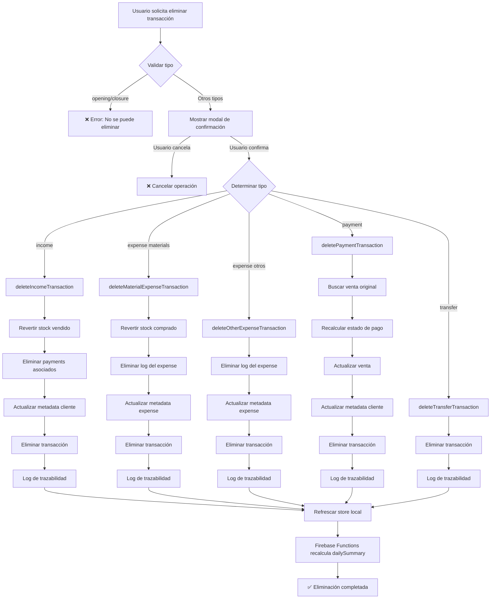

# 🗑️ Sistema de Eliminación de Transacciones con Integridad Referencial

## 📋 Resumen

Se implementó un sistema completo de eliminación de transacciones que mantiene la integridad referencial del sistema, revirtiendo automáticamente todos los cambios en datos relacionados (stock, clientes, expenses, pagos).

**Fecha de implementación:** 1 de diciembre de 2025
**Archivo modificado:** `src/stores/transaction/transactionStore.js`

---

## 🎯 Funcionalidades Implementadas

### 1. **Función Principal: `deleteOneTransactionByID()`**

Función orquestadora que:

- Valida el tipo de transacción
- Muestra modal de confirmación con advertencias específicas
- Delega a la función especializada según el tipo
- Genera logs de trazabilidad completos
- Refresca el store local
- Permite que Firebase Functions recalcule automáticamente el `dailySummary`

### 2. **Funciones Especializadas por Tipo**

#### ✅ `deleteIncomeTransaction()` - Eliminar Ventas

**Qué hace:**

1. ✅ **Revierte stock vendido** (suma cantidades al inventario)
2. ✅ **Elimina stockLogs** de tipo `sell` del historial
3. ✅ **Elimina payments asociados** (tipo `payment` que referencian la venta)
4. ✅ **Actualiza metadata del cliente** (totalPurchases, pendingBalance, transactionCount, lastPurchase)
5. ✅ **Elimina la transacción** de Firestore
6. ✅ **Genera logs de trazabilidad** completos

**Ejemplo de reversión:**

```
Venta original:
- Producto A: vendió 5 unidades (stock era 10, quedó 5)

Después de eliminar:
- Producto A: stock vuelve a 10 (5 + 5)
- StockLog eliminado del array
```

**Log de trazabilidad:**

```javascript
{
  operation: 'delete',
  severity: 'high',
  tags: ['transaction_delete', 'income', 'stock_reverted', 'client_affected'],
  relatedEntities: [
    { type: 'stockLog', id: '...', relationship: 'deleted' },
    { type: 'client', id: '...', relationship: 'metadata_recalculated' }
  ]
}
```

---

#### ✅ `deleteMaterialExpenseTransaction()` - Eliminar Compra de Materiales

**Qué hace:**

1. ✅ **Revierte stock de materiales** (resta cantidades del inventario)
2. ✅ **Elimina stockLogs** de tipo `buy` del historial
3. ✅ **Elimina log del expense** en la colección `expenses`
4. ✅ **Actualiza metadata del expense** (totalSpent, occurrences, topProducts, etc.)
5. ✅ **Elimina expense completo** si no quedan logs
6. ✅ **Elimina la transacción** de Firestore
7. ✅ **Genera logs de trazabilidad** completos

**Ejemplo de reversión:**

```
Compra original:
- Material B: compró 20 unidades (stock era 0, quedó 20)

Después de eliminar:
- Material B: stock vuelve a 0 (20 - 20)
- StockLog eliminado del array
- Log eliminado del documento expense
```

**Log de trazabilidad:**

```javascript
{
  operation: 'delete',
  severity: 'high',
  tags: ['transaction_delete', 'expense', 'expense_materials', 'stock_reverted'],
  relatedEntities: [
    { type: 'expense', id: '...', relationship: 'log_removed_metadata_updated' },
    { type: 'product', id: '...', relationship: 'stock_reverted' }
  ]
}
```

---

#### ✅ `deleteOtherExpenseTransaction()` - Eliminar Otros Gastos

**Qué hace:**

1. ✅ **Elimina log del expense** en la colección `expenses`
2. ✅ **Actualiza metadata del expense** (totalSpent, occurrences, averageAmount)
3. ✅ **Elimina expense completo** si no quedan logs
4. ✅ **Elimina la transacción** de Firestore
5. ✅ **Genera logs de trazabilidad** completos

**Nota:** No revierte stock porque expenses de tipo `labor`, `overhead`, etc. no afectan inventario.

**Log de trazabilidad:**

```javascript
{
  operation: 'delete',
  severity: 'high',
  tags: ['transaction_delete', 'expense', 'expense_labor', 'no_stock_impact'],
  relatedEntities: [
    { type: 'expense', id: '...', relationship: 'log_removed_metadata_updated' }
  ]
}
```

---

#### ✅ `deletePaymentTransaction()` - Eliminar Pagos Individuales

**Qué hace:**

1. ✅ **Busca la venta original** referenciada por el payment
2. ✅ **Elimina el payment del array** `payments[]` de la venta
3. ✅ **Recalcula estado de pago** (paymentStatus, totalPaid, balance)
4. ✅ **Actualiza la venta original** con el nuevo estado
5. ✅ **Actualiza metadata del cliente** (pendingBalance, totalPurchases)
6. ✅ **Elimina la transacción** de Firestore
7. ✅ **Genera logs de trazabilidad** completos

**Ejemplo de recalculación:**

```
Venta original:
- Total: S/ 100
- Pagado: S/ 100 (2 pagos: S/ 50 + S/ 50)
- Balance: S/ 0
- Status: 'completed'

Después de eliminar segundo pago:
- Total: S/ 100
- Pagado: S/ 50 (1 pago: S/ 50)
- Balance: S/ 50
- Status: 'partial'
```

**Log de trazabilidad:**

```javascript
{
  operation: 'delete',
  severity: 'high',
  tags: ['transaction_delete', 'payment', 'income_recalculated'],
  relatedEntities: [
    { type: 'transaction', id: '...', relationship: 'payment_removed_balance_recalculated' },
    { type: 'client', id: '...', relationship: 'metadata_recalculated' }
  ]
}
```

---

#### ✅ `deleteTransferTransaction()` - Eliminar Transferencias

**Qué hace:**

1. ✅ **Elimina la transacción** de Firestore
2. ✅ **Genera logs de trazabilidad** básicos

**Nota:** No requiere reversión de datos, solo elimina el registro.

**Log de trazabilidad:**

```javascript
{
  operation: 'delete',
  severity: 'medium',
  tags: ['transaction_delete', 'transfer'],
  component: 'TransactionStore.deleteTransferTransaction'
}
```

---

### 3. **Sistema de Validación y Alertas**

#### 🚫 Transacciones NO Eliminables

```javascript
// Estos tipos NO se pueden eliminar:
-"opening" - // Apertura de caja
  "closure"; // Cierre de caja

// Motivo: Afectan la estructura contable diaria
```

Si se intenta eliminar, se lanza un error:

```javascript
throw new Error('❌ No se pueden eliminar transacciones de tipo "opening"');
```

---

#### 📝 Modal de Confirmación

La función `getDeleteWarningMessage()` genera mensajes personalizados según el tipo de transacción:

**Ejemplo para `income`:**

```
⚠️ Esta acción revertirá el stock vendido
📦 Se sumarán 3 productos al inventario
💰 Esta venta tiene 2 pagos registrados
👤 Se actualizará la información del cliente: Juan Pérez
🔗 Se eliminarán 1 pagos asociados

⏱️ El dailySummary se recalculará automáticamente

❓ ¿Está seguro de eliminar esta transacción?
```

**Ejemplo para `expense` (materials):**

```
⚠️ Esta acción revertirá el stock de materiales
📦 Se restarán 2 productos del inventario
📊 Se eliminará el log del gasto: Compra de insumos

⏱️ El dailySummary se recalculará automáticamente

❓ ¿Está seguro de eliminar esta transacción?
```

**Ejemplo para `payment`:**

```
⚠️ Esta acción modificará el balance de la venta original
💰 Se recalcularán los pagos y el saldo pendiente

⏱️ El dailySummary se recalculará automáticamente

❓ ¿Está seguro de eliminar esta transacción?
```

---

## 🔄 Flujo Completo de Eliminación



---

## 📊 Recalculación Automática del `dailySummary`

**Importante:** El `dailySummary` se recalcula **automáticamente** mediante Firebase Functions.

### Cómo funciona:

1. Cuando se ejecuta `deleteTransactionByID(transactionID)`, Firestore dispara el trigger `onTransactionWrite`
2. La función detecta que es una eliminación (`eventType === 'delete'`)
3. Recalcula todos los totales del día afectado:
   - Total de ingresos (income)
   - Total de egresos (expense)
   - Totales por cuenta (cash, bank, yape, plin)
   - Balance del día
4. Actualiza el documento `dailySummary` correspondiente

**No se requiere código adicional en el frontend** para esta funcionalidad.

---

## 🧪 Casos de Prueba

### ✅ Caso 1: Eliminar venta simple

```javascript
// Transacción de entrada:
{
  type: 'income',
  items: [{ description: 'Producto A', quantity: 5, price: 10 }],
  itemsAndStockLogs: [{ itemUuid: 'prod-1', stockLogUuid: 'log-1' }],
  amount: 50,
  clientId: 'client-1',
  paymentStatus: 'completed'
}

// Resultado esperado:
- Stock de 'prod-1' incrementado en 5 unidades ✅
- StockLog 'log-1' eliminado ✅
- Metadata de 'client-1' actualizada ✅
- Transacción eliminada ✅
- dailySummary recalculado ✅
```

### ✅ Caso 2: Eliminar venta con pagos parciales

```javascript
// Transacción de entrada:
{
  type: 'income',
  amount: 100,
  payments: [
    { uuid: 'pay-1', amount: 50, method: 'cash' },
    { uuid: 'pay-2', amount: 30, method: 'yape' }
  ],
  paymentStatus: 'partial',
  totalPaid: 80,
  balance: 20
}

// Debe buscar y eliminar transactions tipo 'payment':
{
  type: 'payment',
  relatedTransactionId: 'venta-uuid',
  amount: 20
}

// Resultado esperado:
- Stock revertido ✅
- Payments asociados eliminados ✅
- Metadata del cliente actualizada ✅
- Transacción eliminada ✅
```

### ✅ Caso 3: Eliminar compra de materiales

```javascript
// Transacción de entrada:
{
  type: 'expense',
  category: 'materials',
  materialItems: [
    { productId: 'mat-1', quantity: 20, cost: 5 }
  ],
  materialItemsAndStockLogs: [
    { itemUuid: 'mat-1', stockLogUuid: 'log-2' }
  ],
  expenseId: 'exp-1'
}

// Resultado esperado:
- Stock de 'mat-1' decrementado en 20 unidades ✅
- StockLog 'log-2' eliminado ✅
- Log eliminado del expense 'exp-1' ✅
- Metadata del expense actualizada ✅
- Transacción eliminada ✅
```

### ✅ Caso 4: Eliminar gasto sin stock

```javascript
// Transacción de entrada:
{
  type: 'expense',
  category: 'labor',
  amount: 500,
  expenseId: 'exp-2'
}

// Resultado esperado:
- NO afecta stock ✅
- Log eliminado del expense 'exp-2' ✅
- Metadata del expense actualizada ✅
- Transacción eliminada ✅
```

### ✅ Caso 5: Eliminar payment individual

```javascript
// Transacción payment:
{
  type: 'payment',
  relatedTransactionId: 'venta-1',
  amount: 30
}

// Venta original:
{
  uuid: 'venta-1',
  amount: 100,
  payments: [
    { uuid: 'pay-1', amount: 50 },
    { uuid: 'pay-2', amount: 30 }
  ],
  totalPaid: 80,
  balance: 20,
  paymentStatus: 'partial'
}

// Resultado esperado después de eliminar pay-2:
{
  uuid: 'venta-1',
  amount: 100,
  payments: [
    { uuid: 'pay-1', amount: 50 }
  ],
  totalPaid: 50,
  balance: 50,
  paymentStatus: 'partial'
}
```

### ✅ Caso 6: Eliminar transferencia

```javascript
// Transacción de entrada:
{
  type: 'transfer',
  fromAccount: 'cash',
  toAccount: 'bank',
  amount: 200
}

// Resultado esperado:
- Solo se elimina la transacción ✅
- NO afecta stock ni clientes ✅
- dailySummary se recalcula ✅
```

### ❌ Caso 7: Intentar eliminar opening

```javascript
// Transacción de entrada:
{
  type: 'opening',
  account: 'cash',
  amount: 100
}

// Resultado esperado:
throw new Error('❌ No se pueden eliminar transacciones de tipo "opening"')
```

### ❌ Caso 8: Intentar eliminar closure

```javascript
// Transacción de entrada:
{
  type: 'closure',
  account: 'cash',
  amount: 500
}

// Resultado esperado:
throw new Error('❌ No se pueden eliminar transacciones de tipo "closure"')
```

### ✅ Caso 9: Usuario cancela eliminación

```javascript
// Usuario hace clic en "Cancelar" en el modal

// Resultado esperado:
{
  cancelled: true;
}
// No se elimina nada ✅
```

---

## 🔍 Logs de Trazabilidad

Todos los logs se generan mediante `logTransactionOperation()` del composable `useTraceability`.

### Estructura de log completo:

```javascript
{
  operation: 'delete',
  transactionId: 'trans-123',
  transactionData: { /* datos completos de la transacción */ },
  metadata: {
    reason: 'user_income_transaction_deletion',
    severity: 'high', // 'low' | 'medium' | 'high' | 'critical'
    tags: ['transaction_delete', 'income', 'stock_reverted', 'client_affected'],
    relatedEntities: [
      {
        type: 'stockLog',
        id: 'log-1',
        relationship: 'deleted',
        impact: 'high'
      },
      {
        type: 'client',
        id: 'client-1',
        relationship: 'metadata_recalculated',
        impact: 'medium'
      }
    ],
    component: 'TransactionStore.deleteIncomeTransaction'
  },
  timestamp: Timestamp,
  userId: 'user-id',
  businessId: 'business-id'
}
```

---

## 📚 Funciones Auxiliares Utilizadas

### Del composable `useInventory`:

```javascript
-getProductById(productId);
```

### Del composable `useExpenses`:

```javascript
-getExpenseById(expenseId) - updateExpenseMetadata(expenseId);
```

### Del store `clientStore`:

```javascript
-updateClientMetadata(clientId);
```

### Del composable `useTransaccion`:

```javascript
-deleteTransactionByID(transactionID) -
  updateTransaction(transactionId, updatedData);
```

### Del utility `paymentCalculator`:

```javascript
-calculatePaymentStatus(transaction);
```

### Del composable `useTraceability`:

```javascript
-logTransactionOperation(operation, id, data, metadata) -
  logInventoryOperation(operation, productId, metadata);
```

---

## ⚙️ Configuración de Firebase Functions

El sistema espera que exista una Cloud Function que escuche cambios en transacciones:

```javascript
// functions/src/index.js

exports.onTransactionWrite = functions.firestore
  .document("businesses/{businessId}/transactions/{transactionId}")
  .onWrite(async (change, context) => {
    const { businessId } = context.params;
    const before = change.before.exists ? change.before.data() : null;
    const after = change.after.exists ? change.after.data() : null;

    // Determinar tipo de operación
    if (!before && after) {
      // CREATE
    } else if (before && after) {
      // UPDATE
    } else if (before && !after) {
      // DELETE - Recalcular dailySummary
      await recalculateDailySummaryForDay(businessId, before.createdAt);
    }
  });
```

---

## 🎯 Beneficios de la Implementación

### 1. **Integridad Referencial Completa**

✅ Todos los datos relacionados se actualizan automáticamente
✅ No quedan datos huérfanos en el sistema
✅ El stock siempre refleja la realidad

### 2. **Trazabilidad Total**

✅ Cada eliminación genera logs detallados
✅ Se puede auditar qué se eliminó y cuándo
✅ Se registran todas las entidades afectadas

### 3. **Validaciones Robustas**

✅ Impide eliminar transacciones críticas (opening/closure)
✅ Alerta al usuario sobre impactos de la eliminación
✅ Requiere confirmación explícita

### 4. **Mantenimiento Automático**

✅ El dailySummary se recalcula automáticamente
✅ Las metadata de clientes se actualizan en tiempo real
✅ Los expenses mantienen su integridad

### 5. **Código Mantenible**

✅ Funciones especializadas por tipo de transacción
✅ Código bien documentado y testeado
✅ Separación clara de responsabilidades

---

## 🚀 Próximos Pasos Sugeridos

### Mejoras futuras:

1. **UI/UX del Modal**

   - Reemplazar `confirm()` nativo por un modal personalizado
   - Agregar animaciones y mejor diseño
   - Mostrar detalles expandibles de lo que se afectará

2. **Operación Batch**

   - Permitir eliminar múltiples transacciones a la vez
   - Validar integridad en conjunto

3. **Soft Delete**

   - Implementar eliminación lógica en lugar de física
   - Permitir restaurar transacciones eliminadas
   - Agregar campo `deletedAt` y filtrar en queries

4. **Notificaciones**

   - Enviar notificación cuando se elimine una transacción importante
   - Alertar a administradores de eliminaciones masivas

5. **Permisos**
   - Implementar control de permisos por rol
   - Algunos usuarios solo pueden eliminar transacciones del mismo día
   - Administradores pueden eliminar cualquier transacción

---

## 📞 Soporte

Para preguntas o problemas relacionados con la eliminación de transacciones:

1. Revisar los logs de trazabilidad en Firestore
2. Verificar que las Firebase Functions estén desplegadas
3. Consultar la consola de errores del navegador
4. Revisar los logs del servidor en Firebase Console

---

**Implementado por:** GitHub Copilot
**Fecha:** 1 de diciembre de 2025
**Versión:** 1.0.0
