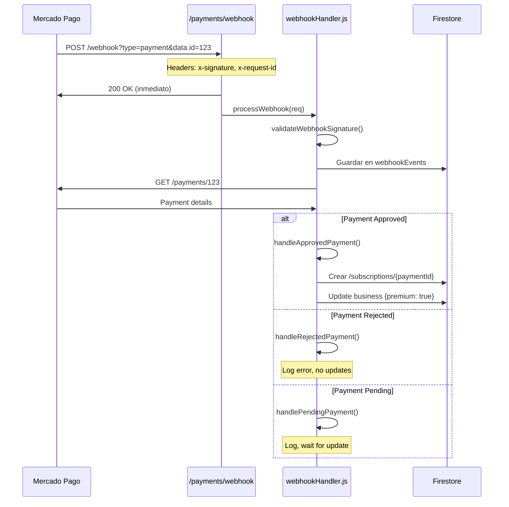

# 🎉 RESUMEN DE IMPLEMENTACIÓN - WEBHOOKS Y PLAN DE PRUEBA

## ✅ Completado

### 1. Plan de Prueba (S/ 5)

Se agregó un nuevo plan económico para testing en producción:

#### Frontend

- **PlanSelector.vue**: Card con badge "🧪 TEST", S/ 5, 7 días
- **Premium.vue**: Plan "test" agregado a PLAN_CONFIGS, ahora es el plan por defecto
- **YapePayment.vue**: Validación actualizada para incluir "test"

#### Backend

- **paymentService.js**: Plan test con `amount: 5.00`, `duration: 7`
- **yapeService.js**: Plan test con `amount: 5.00`, `duration: 7`
- **paymentEndpoints.js**: Validación actualizada: `['test', 'monthly', 'annual', 'lifetime']`

### 2. Sistema de Webhooks Completo

#### webhookHandler.js

- ✅ Validación de firma con `x-signature` y `x-request-id`
- ✅ Procesamiento de eventos `payment.created` y `payment.updated`
- ✅ Manejo de estados: approved, rejected, pending
- ✅ Activación automática de suscripciones
- ✅ Guardado de eventos en colección `webhookEvents`
- ✅ Soporte para los 4 planes (test, monthly, yearly, lifetime)

**Funciones implementadas:**

```javascript
validateWebhookSignature(req);
processWebhook(req);
handleApprovedPayment(businessId, planType, payment);
handleRejectedPayment(businessId, payment);
handlePendingPayment(businessId, payment);
saveWebhookEvent(req);
```

#### paymentEndpoints.js

- ✅ Endpoint POST `/payments/webhook` activado
- ✅ Respuesta inmediata con 200 OK (requisito de Mercado Pago)
- ✅ Procesamiento asíncrono del webhook

### 3. Documentación

#### WEBHOOK_LOCAL_TESTING.md (NUEVO)

Guía completa de testing local con ngrok:

- Instalación y configuración de ngrok
- Setup de Firebase Emulators
- Configuración de webhook en MP Dashboard
- Variables de entorno (MP_WEBHOOK_SECRET)
- Troubleshooting común
- Diagrama de flujo completo

#### MERCADOPAGO_PRODUCTION_GUIDE.md (ACTUALIZADO)

- Sección de configuración de webhooks en producción
- Instrucciones para obtener y configurar el secret
- Checklist actualizado con pasos de webhook
- Testing con plan de prueba (S/ 5)

#### YAPE_TESTING_GUIDE.md (ACTUALIZADO)

- Plan de prueba agregado a la lista de planes
- Resultado esperado incluye plan "Premium Prueba" y monto S/ 5.00
- Expiración en 7 días

---

## 🏗️ Arquitectura del Sistema de Webhooks



---

## 📋 Estructura de Datos

### Colección: `webhookEvents`

```javascript
{
  type: "payment",
  dataId: "123456789",
  query: { type: "payment", "data.id": "123456789" },
  headers: {
    "x-signature": "ts=...,v1=...",
    "x-request-id": "..."
  },
  body: {},
  timestamp: Timestamp
}
```

### Subcolección: `business/{businessId}/subscriptions/{paymentId}`

```javascript
{
  planType: "test",
  planName: "Premium Prueba",
  startDate: Timestamp,
  expiryDate: Timestamp, // +7 días para plan test
  status: "active",
  paymentId: "123456789",
  paymentMethod: "yape",
  amount: 5.00,
  currency: "PEN",
  createdAt: Timestamp,
  updatedAt: Timestamp
}
```

### Documento: `business/{businessId}`

```javascript
{
  premium: true,
  premiumPlan: "test",
  premiumStartDate: Timestamp,
  premiumExpiryDate: Timestamp, // +7 días
  updatedAt: Timestamp
}
```

---

## 🧪 Testing en Desarrollo Local

### Setup Rápido

```bash
# Terminal 1: Emulators
firebase emulators:start

# Terminal 2: ngrok
ngrok http 5001

# Terminal 3: Frontend
npm run dev
```

### URL del Webhook Local

```
https://xxxx-xxxx.ngrok-free.app/wala-lat/us-central1/payments/webhook
```

### Configurar en MP Dashboard (Modo Producción)

1. URL: `https://xxxx-xxxx.ngrok-free.app/wala-lat/us-central1/payments/webhook`
2. Eventos: `payment.created`, `payment.updated`
3. Copiar secret → `functions/.env.local`: `MP_WEBHOOK_SECRET=...`

### Hacer Pago de Prueba

- Plan: **Prueba (S/ 5)**
- Método: **Yape**
- Celular: `111111111`
- OTP: `123456`

### Verificar

1. Logs: `📬 Webhook recibido`, `🎉 Suscripción activada`
2. Firestore: `webhookEvents` tiene el evento
3. Firestore: `business/{id}` tiene `premium: true`
4. ngrok Dashboard: `http://127.0.0.1:4040`

---

## 🚀 Deployment a Producción

### 1. Configurar Variables de Entorno

**functions/.env**

```bash
MP_ACCESS_TOKEN=APP_USR-6078108162612691-012223-2e0e981864dc529290cbf88fdad8eeb2-1105396361
MP_PUBLIC_KEY=APP_USR-168b04ae-9119-48e7-91bd-dc6a046acbfd
MP_WEBHOOK_SECRET=tu_secret_de_mercadopago
```

**.env.production**

```bash
VITE_MP_PUBLIC_KEY=APP_USR-168b04ae-9119-48e7-91bd-dc6a046acbfd
```

### 2. Desplegar Functions

```bash
firebase deploy --only functions:payments
```

### 3. Configurar Webhook en MP (Producción)

1. URL: `https://southamerica-east1-wala-lat.cloudfunctions.net/payments/webhook`
2. Eventos: `payment.created`, `payment.updated`
3. Copiar secret → `functions/.env`: `MP_WEBHOOK_SECRET=...`
4. Redesplegar: `firebase deploy --only functions:payments`

### 4. Desplegar Frontend

```bash
npm run build
firebase deploy --only hosting
```

### 5. Testing en Producción

1. Ir a tu sitio: `https://wala-lat.web.app`
2. Seleccionar plan **Prueba (S/ 5)**
3. Pagar con Yape usando app real
4. Verificar webhook en logs de Firebase Console

---

## 🔧 Troubleshooting

### ❌ "Firma de webhook inválida"

- Verificar que `MP_WEBHOOK_SECRET` esté configurado correctamente
- Reiniciar functions después de cambiar variables de entorno
- En desarrollo, el código permite webhooks sin firma válida

### ❌ Webhook no llega

- Verificar que la URL esté correcta en MP Dashboard
- En ngrok, verificar que esté corriendo: `ngrok http 5001`
- Ver logs en ngrok dashboard: `http://127.0.0.1:4040`

### ❌ No se activa suscripción

- Verificar que metadata del pago incluya `business_id` y `plan_type`
- Ver logs: `📬 Webhook recibido`, `✅ Procesando pago aprobado`
- Verificar que el payment status sea `approved`

---

## 📝 Notas Importantes

- ⚠️ ngrok URL cambia cada vez que se reinicia (a menos que tengas plan pago)
- ⚠️ Actualizar URL en MP Dashboard si cambias la URL de ngrok
- ✅ En desarrollo, webhooks funcionan sin firma válida para facilitar testing
- ✅ Todos los eventos se guardan en `webhookEvents` para debugging
- 🧪 Usar plan de prueba (S/ 5) para evitar costos altos en testing

---

## 🎯 Próximos Pasos

1. ✅ Probar webhooks en desarrollo local con ngrok
2. ✅ Hacer pago de prueba con plan test (S/ 5)
3. ✅ Verificar que suscripción se active correctamente
4. ✅ Desplegar a producción
5. ✅ Configurar webhook en MP Dashboard (producción)
6. ✅ Hacer pago real con plan test (S/ 5)
7. ✅ Una vez validado, habilitar planes reales (S/ 27, S/ 200, S/ 400)

---

## 📚 Documentación Relacionada

- [WEBHOOK_LOCAL_TESTING.md](./WEBHOOK_LOCAL_TESTING.md) - Testing con ngrok
- [MERCADOPAGO_PRODUCTION_GUIDE.md](./MERCADOPAGO_PRODUCTION_GUIDE.md) - Deployment a producción
- [YAPE_TESTING_GUIDE.md](./YAPE_TESTING_GUIDE.md) - Testing de pagos Yape

---

**Fecha de implementación:** Enero 2024
**Estado:** ✅ Completado y listo para testing
