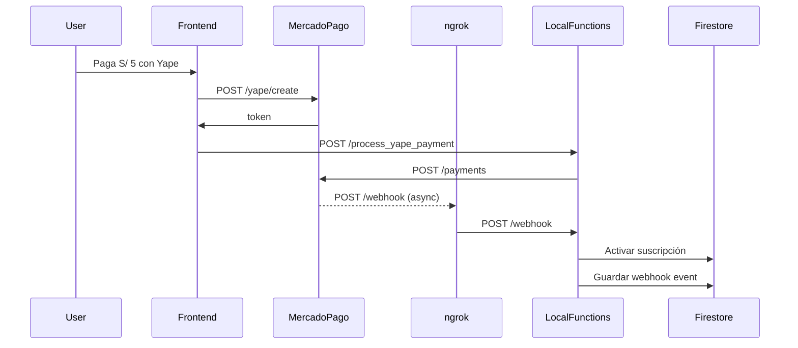

# Guía de Testing Local de Webhooks con ngrok

Esta guía explica cómo probar los webhooks de Mercado Pago en tu entorno local usando ngrok.

## Requisitos Previos

- Node.js y Firebase CLI instalados
- Cuenta de ngrok (gratis)
- Firebase Emulators configurados
- Credenciales de Mercado Pago de producción configuradas

## Paso 1: Instalar ngrok

### Windows

```powershell
# Descargar desde https://ngrok.com/download
# O usar chocolatey
choco install ngrok
```

### Verificar instalación

```bash
ngrok version
```

## Paso 2: Iniciar Firebase Emulators

En el directorio raíz del proyecto:

```bash
firebase emulators:start
```

Esto iniciará:

- Functions en `http://localhost:5001`
- Firestore en `http://localhost:8080`
- Auth en `http://localhost:9099`

## Paso 3: Iniciar ngrok

En otra terminal, ejecuta:

```bash
ngrok http 5001
```

Verás una salida como esta:

```
Session Status                online
Account                       tu-email@gmail.com
Version                       3.x.x
Region                        United States (us)
Forwarding                    https://xxxx-xx-xx-xxx-xxx.ngrok-free.app -> http://localhost:5001
```

**🔑 IMPORTANTE:** Copia la URL HTTPS que aparece en "Forwarding" (ej: `https://xxxx-xx-xx-xxx-xxx.ngrok-free.app`)

## Paso 4: Configurar Webhook en Mercado Pago

1. Ve a https://www.mercadopago.com.pe/developers/panel/webhooks
2. Crea un nuevo webhook
3. Configura la URL:

   ```
   https://xxxx-xx-xx-xxx-xxx.ngrok-free.app/wala-lat/us-central1/payments/webhook
   ```

   > ⚠️ Reemplaza `xxxx-xx-xx-xxx-xxx` con tu URL de ngrok
   >
   > ⚠️ Ajusta `wala-lat` y `us-central1` según tu configuración de Firebase

4. Selecciona los eventos:

   - ✅ `payment.created`
   - ✅ `payment.updated`

5. Guarda el webhook
6. **COPIA EL SECRET** que aparece y guárdalo como variable de entorno

## Paso 5: Configurar Secret del Webhook

Crea o actualiza el archivo `.env.local` en la carpeta `functions`:

```bash
MP_WEBHOOK_SECRET=tu_webhook_secret_aqui
```

Reinicia los emulators para que cargue la nueva variable.

## Paso 6: Probar el Webhook

### Opción A: Hacer un pago real de prueba

1. Ve a tu aplicación local: `http://localhost:5173`
2. Selecciona el plan de **Prueba (S/ 5)**
3. Realiza el pago con Yape usando:
   - Teléfono: `111111111`
   - OTP: `123456`

### Opción B: Simular notificación manualmente

Desde Postman o curl:

```bash
curl -X POST "https://xxxx-xx-xx-xxx-xxx.ngrok-free.app/wala-lat/us-central1/payments/webhook?type=payment&data.id=PAYMENT_ID" \
  -H "x-signature: ts=1234567890,v1=signature_hash" \
  -H "x-request-id: request-id-123" \
  -H "Content-Type: application/json"
```

## Paso 7: Verificar Logs

### En la terminal de Firebase Emulators:

Deberías ver logs como:

```
📬 Webhook recibido: { type: 'payment', dataId: '123456789' }
✅ Procesando pago aprobado: { businessId: 'xxx', planType: 'test', paymentId: 123456789, amount: 5 }
🎉 Suscripción activada vía webhook: { businessId: 'xxx', planType: 'test', expiryDate: 2024-02-01T00:00:00.000Z }
```

### En el Dashboard de ngrok:

Ve a `http://127.0.0.1:4040` para ver las peticiones HTTP en tiempo real.

## Paso 8: Verificar en Firestore

En el Emulator UI de Firestore (`http://localhost:4000/firestore`), verifica:

1. Colección `webhookEvents` - debe tener el evento guardado
2. Documento `business/{businessId}` - debe tener:
   - `premium: true`
   - `premiumPlan: "test"`
   - `premiumExpiryDate: Timestamp`
3. Subcolección `subscriptions` - debe tener el pago guardado

## Troubleshooting

### ❌ Error: "Firma de webhook inválida"

**Causa:** El secret del webhook no coincide

**Solución:**

1. Verifica que copiaste correctamente el secret de MP Dashboard
2. Reinicia los emulators después de actualizar `.env.local`
3. En desarrollo, el código permite webhooks sin firma - revisa los logs

### ❌ Error: "404 Not Found"

**Causa:** La URL del webhook es incorrecta

**Solución:**

1. Verifica el nombre de tu proyecto Firebase
2. Verifica la región de las functions
3. Asegúrate de usar la URL de ngrok actualizada (cambia cada vez que reinicias)

### ❌ No aparecen logs

**Causa:** ngrok no está redireccionando correctamente

**Solución:**

1. Reinicia ngrok: `ngrok http 5001`
2. Actualiza la URL en Mercado Pago Dashboard
3. Verifica que los emulators estén corriendo

### ❌ "MP_WEBHOOK_SECRET no configurado"

**Causa:** Variable de entorno faltante

**Solución:**

1. Crea `.env.local` en `functions/`
2. Agrega: `MP_WEBHOOK_SECRET=tu_secret`
3. Reinicia emulators

## Flujo Completo de Testing



## Comandos Rápidos

```bash
# Terminal 1: Iniciar emulators
firebase emulators:start

# Terminal 2: Iniciar ngrok
ngrok http 5001

# Terminal 3: Ver logs de ngrok
# Navegar a http://127.0.0.1:4040
```

## Notas Importantes

- ⚠️ La URL de ngrok cambia cada vez que reinicias (a menos que tengas plan pago)
- ⚠️ Actualiza la URL en MP Dashboard cada vez que cambies
- ✅ En desarrollo, el webhook acepta peticiones sin firma válida
- ✅ Todos los eventos se guardan en `webhookEvents` para debugging
- 🧪 Usa el plan de prueba (S/ 5) para evitar costos altos

## Siguiente Paso: Producción

Una vez que todo funcione localmente, sigue la guía [MERCADOPAGO_PRODUCTION_GUIDE.md](./MERCADOPAGO_PRODUCTION_GUIDE.md) para desplegar en producción.
