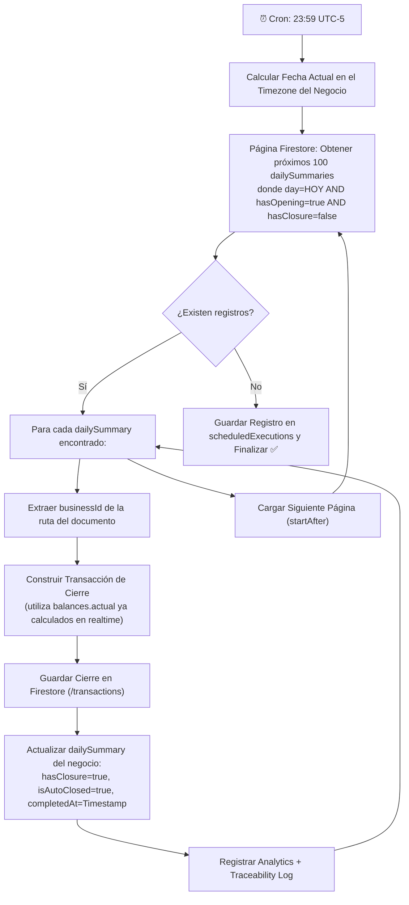

# Cierre Diario Automático Optimizado (Scheduled Auto-Close)

**Fecha:** Mayo 2026  
**Estado:** ✅ Implementado y Desplegado  
**Archivo Fuente:** `functions/src/AccountsBalance/scheduledAutoClose.js`

---

## 🎯 Contexto e Impacto del Refactor

Anteriormente, la función `scheduledAutoClose` ejecutaba un barrido completo de la base de datos (`db.collection('businesses').get()`), lo cual resultaba ineficiente ($O(N)$ sobre el 100% de los usuarios). Con un crecimiento proyectado por encima de los 1,000 negocios, este diseño generaba riesgos inminentes de timeouts (540s) y costos excesivos de Cloud Firestore.

Además, el diseño anterior incluía un proceso de "Auto-Apertura" para negocios inactivos y un retardo forzado `sleep(2000)` por negocio que ralentizaba masivamente la ejecución.

**El nuevo diseño cambia radicalmente la estrategia a un modelo basado en actividad.**

---

## 💡 Principales Optimizaciones

### 1. Filtrado por Collection Group Directo en Firestore
En lugar de traer todos los negocios a memoria, se realiza una consulta de grupo de colecciones (`collectionGroup`) apuntando a `dailySummaries`. 

**Query Lógica:**
```javascript
db.collectionGroup('dailySummaries')
  .where('day', '==', 'YYYY-MM-DD')
  .where('hasOpening', '==', true)
  .where('hasClosure', '==', false)
```

Esto garantiza que **solo se procesan los negocios que abrieron caja hoy y no la han cerrado**. El resto del universo de usuarios (usuarios inactivos o prolijos que cerraron su caja) consume exactamente $0$ lecturas y $0$ tiempo de CPU.

### 2. Paginación Incorporada (Batching)
Para soportar escalas de decenas de miles de operaciones diarias, la función implementa paginación recursiva mediante `limit(100)` y `startAfter(lastDoc)`. Se procesa página por página para garantizar estabilidad de memoria.

### 3. Eliminación de "Ghost Operations"
*   ❌ **Auto-Opening**: Eliminado. Si el negocio no registró apertura manual el día de hoy, el cron job no generará registros artificiales de apertura.
*   ❌ **Timeouts / Sleep**: Eliminado el retardo artificial de 2000ms. El flujo aprovecha directamente los balances ya consolidados en el resumen diario.

---

## 🔄 Flujo de Ejecución (23:59 America/Lima)



---

## 📋 Índices Requeridos

Para que esta optimización funcione, Firestore exige un índice compuesto de alcance de grupo de colección definido en `firestore.indexes.json`:

```json
{
  "collectionGroup": "dailySummaries",
  "queryScope": "COLLECTION_GROUP",
  "fields": [
    { "fieldPath": "day", "order": "ASCENDING" },
    { "fieldPath": "hasOpening", "order": "ASCENDING" },
    { "fieldPath": "hasClosure", "order": "ASCENDING" }
  ]
}
```

---

## 📊 Comparativa de Performance

| Métrica | Modelo Anterior (N Usuarios) | Nuevo Modelo Optimizado |
| :--- | :--- | :--- |
| **Lecturas de Negocios** | $N$ (Siempre lee a todos) | $A$ (Solo lee negocios activos sin cierre) |
| **Auto-Opening Fantasmas** | Sí (Ensuciaba data histórica) | ❌ No (Respeta días de inactividad real) |
| **Velocidad de ejecución** | Lenta ($2 \text{ seg} \times N$) | Instantánea (en lote) |
| **Tiempo Máximo (Soporte)**| Límite teórico: ~250 negocios | Límite teórico: >10,000 negocios |

---

## 🛡️ Trazabilidad y Monitoreo

Cada ejecución guarda un rastro de auditoría completo:
1.  **Traceability Log**: Dentro del negocio, en `/traceability_logs` con el tipo `auto_close` y detalles financieros para análisis forense.
2.  **Analytics**: Dispara `trackAutoDayClosed` para contabilizar cuántos negocios se cerraron por sistema.
3.  **Log Central**: Registra un resumen consolidado en la colección global `/scheduledExecutions` con métricas de duración, errores e impacto de la corrida.
