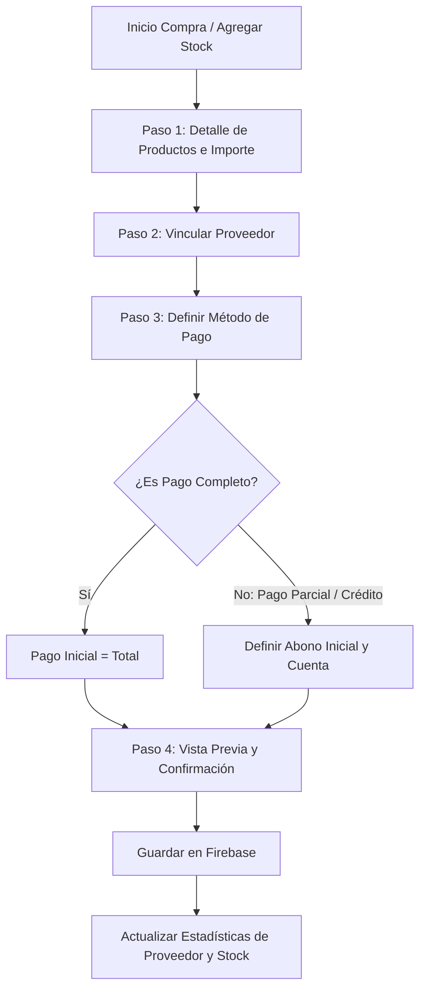

# Documentación Técnica: Módulo de Proveedores y Cuentas por Pagar (WALA)

Este documento detalla la arquitectura, el flujo de datos, la estructura de base de datos y la experiencia de usuario del módulo de **Proveedores** y **Cuentas por Pagar** implementado en la plataforma WALA, diseñado como un símil del flujo preexistente de Clientes y Cuentas por Cobrar.

---

## 1. Arquitectura de Datos (Firestore)

Las cuentas por pagar no constituyen una colección física separada, sino que se derivan de forma dinámica en tiempo real filtrando las transacciones de egreso con saldo pendiente.

### A. Proveedores (`suppliers`)
Cada negocio gestiona sus propios proveedores en una subcolección dentro de su documento de negocio.
* **Ruta de Colección**: `businesses/{businessId}/suppliers/{supplierId}`
* **Campos del Documento**:
  ```typescript
  interface Supplier {
    supplierId: string;        // ID único (UUID auto-generado)
    name: string;              // Nombre o Razón Social del proveedor
    phone: string;             // Número de contacto / Teléfono
    createdAt: Date | any;     // Fecha de registro
    // Campos estadísticos (Mantenidos dinámicamente)
    totalPurchases?: number;   // Suma acumulada de compras totales históricas
    totalDebt?: number;        // Saldo total pendiente de pago
  }
  ```

### B. Transacciones de Egreso y Crédito (`transactions`)
Cuando se efectúa una compra a crédito o con pago parcial, se registra una transacción en la colección principal:
* **Ruta de Colección**: `businesses/{businessId}/transactions/{transactionId}`
* **Campos Clave**:
  * `type`: `'expense'` (Identifica que es un egreso).
  * `supplierId` / `supplierName`: IDs y nombres para vinculación bidireccional.
  * `paymentStatus`: `'completed' | 'partial' | 'pending'` (Estado de liquidación).
  * `amount`: Monto total facturado de la compra.
  * `totalPaid`: Suma acumulada de los pagos ya realizados.
  * `balance`: Saldo restante pendiente de pago (`amount` - `totalPaid`).
  * `payments`: Arreglo de abonos (el primer elemento es el abono inicial):
    ```typescript
    payments: Array<{
      amount: number;
      account: 'cash' | 'bank';
      date: any;
      description?: string;
    }>
    ```

---

## 2. Flujo de Registro y Compras

La asignación de proveedores y el método de pago parcial se integran de manera nativa en el flujo transaccional de **Abastecimiento de Inventario (Compras/Gastos)**.



### Detalle de los Pasos de Compra:
1. **Asociación de Proveedor** (StepAttachSupplier.vue):
   * Permite buscar entre proveedores existentes o registrar rápidamente uno nuevo usando solo **Nombre** y **Teléfono**.
2. **Método de Pago** (StepPaymentMethodExpense.vue):
   * Da la opción de liquidar en el momento o seleccionar **"Pago Parcial / Crédito"**.
   * Si se elige crédito, el usuario ingresa el **Abono Inicial** (puede ser 0) y selecciona la cuenta de origen del dinero (Efectivo o Banco).
3. **Guardado e Inventario** (AddStock.vue y useInventory.js):
   * Se procesa la actualización de inventario.
   * Se crea la transacción de tipo `expense` vinculando los datos del proveedor y del pago parcial.
   * Se incrementa automáticamente en el perfil del proveedor el acumulador `totalPurchases` y la deuda `totalDebt`.

---

## 3. Gestión y Abonos de Cuentas por Pagar

La administración de las deudas y el registro de abonos se realiza desde la vista centralizada de Cuentas por Pagar.

### A. Vista de Cuentas por Pagar (AccountsPayable.vue)
* Agrupa las deudas activas por proveedor.
* Presenta estadísticas críticas: **Deuda Total**, **Total de Proveedores con Deuda** y **Deuda Vencida/Pendiente**.
* Llama al store mediante `fetchPendingPayables` para cargar a memoria únicamente egresos a crédito.

### B. Panel Grupal de Proveedores (AccountsPayablePanel.vue)
* Funciona de forma análoga a `AccountsReceivablePanel.vue`.
* Si no se le pasa una prop `supplierId`, lista todos los proveedores con saldo pendiente agrupados por su Avatar, número de transacciones y monto total de deuda.
* Permite expandir a cada proveedor para ver el historial y desglose de deudas pendientes e historial de abonos realizados.

### C. Registro de Abonos (PaymentRegistrationModal.vue)
Para amortizar una deuda:
1. Se abre el modal de pagos sobre un egreso en particular.
2. Se ingresa el monto a abonar (validado para no exceder el saldo de la deuda).
3. Se escoge la cuenta de procedencia (Efectivo o Banco digital).
4. Al guardar:
   * Se añade el nuevo registro de abono al arreglo `payments` del egreso.
   * Se incrementa `totalPaid` y se reduce `balance`.
   * Si el saldo llega a `0`, `paymentStatus` se actualiza a `'completed'`.
   * Se actualiza en tiempo real el valor de `totalDebt` en la ficha del proveedor.
   * Se crea una transacción de respaldo de tipo `'payment'` vinculada a la cuenta de origen del dinero para fines de cuadre de caja diario.

---

## 4. Visualización en Historial y Cuadre Diario

Los egresos a crédito y sus amortizaciones tienen un tratamiento especial para mantener la integridad del flujo de caja efectivo del negocio.

### A. Tarjetas de Transacción (CardStandard.vue)
* **Badges Visuales**: Muestran etiquetas naranjas de **"Parcial / Falta: S/ [Saldo]"** o rojas de **"Pendiente"** para identificar las deudas rápidamente.
* **Monto Efectivo**: En lugar de mostrar la facturación total del egreso, la tarjeta muestra únicamente el **monto neto pagado** en la fecha de registro (el abono), con una leyenda del total original (ej. `-S/ 10.00 de S/ 150.00`).
* **Vínculo del Proveedor**: Muestra el nombre del proveedor en una pestaña informativa debajo del registro.
* **Separación de Cobros y Pagos (Abonos de tipo 'payment')**:
  * **Cobros de Clientes**: Se identifican por tener `clientId` o `clientName`. Mantienen el diseño verde (`bg-emerald-50`, `+S/ [amount]`) y la etiqueta **"Cobro"**.
  * **Pagos a Proveedores**: Se identifican por tener `supplierId` o `supplierName`. Utilizan un diseño rojizo/rosa (`bg-rose-50 border-rose-200`), el signo negativo (`-S/ [amount]`), la etiqueta **"Pago"** y el nombre del proveedor.

### B. Detalle del Registro (ExpenseDetails.vue)
* Muestra el desglose de amortizaciones en una línea de tiempo (Abono inicial, abonos subsecuentes, fechas, cuentas y saldos pendientes).
* Contiene accesos directos al perfil del proveedor asignado.

### C. Cuadre del Día (ResumenDay.vue)
* **Cálculo de Flujo Real**: Modificado para calcular los totales en tiempo real basados en la lista de transacciones del cliente:
  * **Ingresos de hoy**: Suma las ventas (`income` con su cobro efectivo) y los abonos cobrados a clientes (`payment` de tipo cliente).
  * **Salidas de hoy**: Suma los gastos (`expense` con su abono inicial) y los abonos pagados a proveedores (`payment` de tipo proveedor).
  * Los saldos en caja y bancos se computan igualmente bajo esta separación de flujos efectivos de entrada y salida, asegurando la concordancia del arqueo de caja físico.

---

## 5. Mapeo de Archivos del Módulo

| Tipo de Archivo | Ruta del Archivo | Propósito |
| :--- | :--- | :--- |
| **Definiciones / Tipos** | `src/types/supplier.js` | Documentación JSDoc y esquemas de tipos para proveedores. |
| **Pinia Store** | `src/stores/supplierStore.js` | Lógica de accesos directos a Firestore para CRUD de Proveedores. |
| **Composables** | `src/composables/useSuppliers.js` | Funciones de formateo, estadísticas y listas de proveedores. |
| | `src/composables/useAccountsPayable.js` | Cálculos reactivos de transacciones de egreso a crédito y pagos. |
| **Componentes de Flujo** | `src/components/transactionFlow/StepAttachSupplier.vue` | Paso para vincular un proveedor al abastecimiento. |
| | `src/components/transactionFlow/StepPaymentMethodExpense.vue` | Selección de cuenta de pago y captura de abono inicial de compra. |
| | `src/components/transactionFlow/StepAddExpensePreview.vue` | Vista previa final del egreso con detalle de abono y proveedor. |
| **Componentes de Pago** | `src/components/AccountsPayable/PaymentRegistrationModal.vue` | Ventana emergente para registrar amortizaciones a las deudas. |
| | `src/components/AccountsPayable/AccountsPayablePanel.vue` | Panel interactivo de deudas agrupadas por proveedor (Símil de Cuentas por Cobrar). |
| **Vistas Principales** | `src/views/Suppliers/SuppliersDashboard.vue` | Catálogo e historial comercial de los proveedores. |
| | `src/views/Suppliers/SupplierDetails.vue` | Ficha individual del proveedor, compras y deudas. |
| | `src/views/AccountsPayable.vue` | Dashboard del módulo de Cuentas por Pagar. |
| **Historial y Reportes** | `src/components/HistorialRecords/CardStandard.vue` | Tarjeta estandarizada de visualización del historial (Separando Cobros y Pagos). |
| | `src/components/HistorialRecords/Details/ExpenseDetails.vue` | Detalle de pagos e información del egreso. |
| | `src/components/HistorialRecords/ResumenDay.vue` | Panel de reporte operacional del día (Cálculo real de cobros y pagos). |
